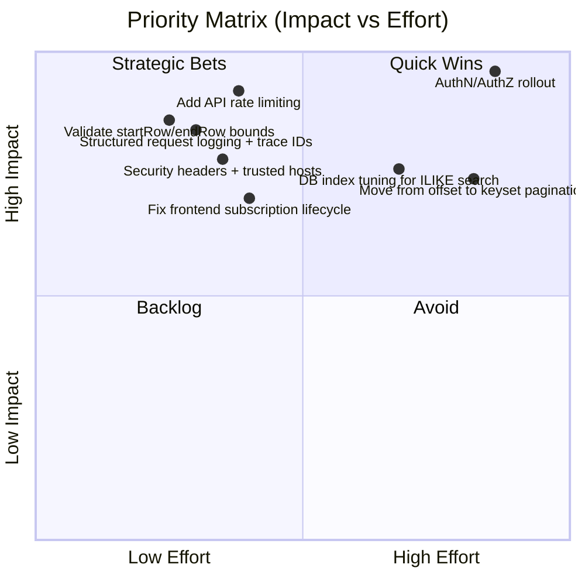
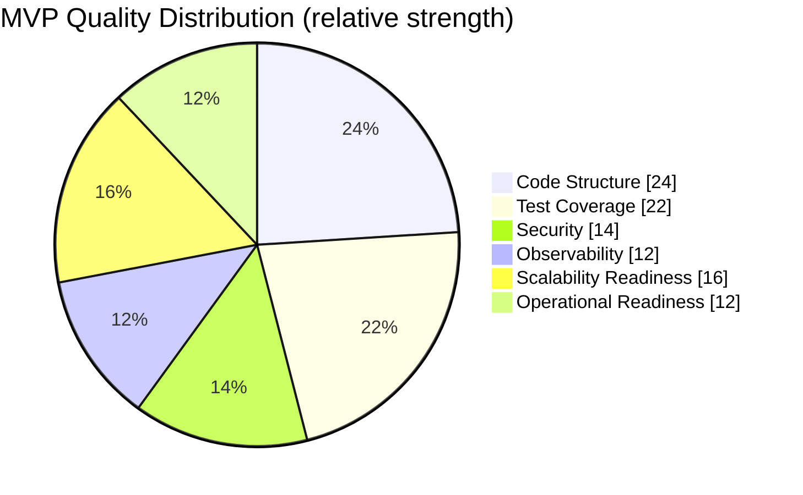
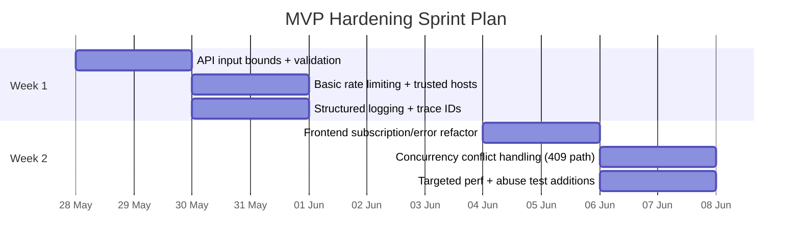

# MVP Technical Review - Code Quality, Security, Efficiency

> [!info] Scope
> Review target: current MVP implementation across backend (`FastAPI + SQLAlchemy`), frontend (`Angular + AG Grid`), testing, and local Docker runtime.
>
> Review lens: **code quality**, **security**, **efficiency/performance**, and **delivery readiness**.

---

## Executive Snapshot

> [!summary] Overall Assessment
> The MVP is a strong baseline: clean layered architecture, readable service boundaries, practical pagination/filtering, and good test coverage for core CRUD paths.
>
> The biggest gaps before hardening are:
> - stronger **input constraints and abuse limits** on list endpoints
> - improved **security posture** (rate limiting, security headers, prod-safe defaults)
> - better **runtime observability and error telemetry**
> - a few **frontend data consistency** edge cases under concurrent edits/rapid actions

---

## What Is Working Well

- Clear backend layering (`router -> service -> db`) makes ownership boundaries easy.
- Pydantic validation is in place for create/update schemas, including positive amount checks.
- AG Grid infinite-row flow and refresh trigger model are coherent for MVP scale.
- Integration + unit tests cover main CRUD and pagination/filtering behaviors.
- Dockerized local environment is practical and reproducible for development.

---

## Findings by Priority

## P0 (High Risk / High Value)

> [!warning] 1) List endpoint lacks strict query bounds
> Current API accepts `startRow/endRow` without explicit validation constraints.
>
> **Risk**
> - Very large page windows can drive expensive DB reads and memory pressure.
> - Negative/invalid combinations can produce undefined pagination behavior.
>
> **Improve**
> - Enforce typed constraints at API boundary (e.g. `startRow >= 0`, `endRow > startRow`, `max window <= N`).
> - Return 422 for invalid windows with clear error payload.

> [!warning] 2) No auth/rate limiting for mutating endpoints
> `POST` and `PATCH` are open in current MVP design.
>
> **Risk**
> - Unauthorized writes, abuse, and test/prod data poisoning.
> - High write volume can become an easy denial-of-service vector.
>
> **Improve**
> - Add basic API key or JWT auth for non-local environments.
> - Add request rate limits (global + per-IP + per-route).
> - Add write-path audit fields/logging for accountability.

> [!warning] 3) Global exception handler hides incident diagnostics
> Generic 500 response is user-safe, but no structured logging/trace correlation is visible.
>
> **Risk**
> - Operationally difficult to triage production incidents.
> - Hidden failure trends until users report them.
>
> **Improve**
> - Log exceptions with request context + correlation ID.
> - Add explicit error classes for expected failures.
> - Integrate monitoring (errors, latency, saturation).

## P1 (Important, near-term hardening)

> [!tip] 4) CORS and environment posture should be stricter outside local
> Dev-friendly defaults are currently broad and easy to misconfigure in real deployment.
>
> **Improve**
> - Separate dev/prod config profiles.
> - Fail fast when default credentials are used in non-local environment.
> - Add secure defaults (`DEBUG=false`, explicit origin allowlist per env).

> [!tip] 5) Frontend subscription lifecycle can leak under heavy interaction
> Grid row fetch/edit calls subscribe directly; repeated interactions may accumulate unmanaged subscriptions.
>
> **Improve**
> - Use `takeUntilDestroyed()` / RxJS finalize patterns.
> - Centralize API error handling in interceptor to reduce duplicated UI error logic.

> [!tip] 6) Inline edit flow lacks optimistic concurrency guard
> Last-write-wins updates may overwrite concurrent edits silently.
>
> **Improve**
> - Use `updated_at` precondition check (or ETag/If-Match).
> - On conflict, return 409 and prompt user to refresh/retry.

## P2 (Efficiency and scaling path)

> [!note] 7) Filter query uses `ILIKE '%term%'` on centre name
> Useful for UX, but can degrade as data grows due to leading wildcard scans.
>
> **Improve**
> - Add trigram index (`pg_trgm`) or search-normalized column.
> - Consider `startswith` filter mode for high-volume datasets.

> [!note] 8) Offset pagination is acceptable now, less ideal at scale
> Offset cost rises with large tables and deeper pages.
>
> **Improve**
> - Keep offset for MVP, but plan keyset/cursor mode for growth.
> - Provide stable sort + cursor token to preserve user navigation consistency.

> [!note] 9) Test suite has limited non-happy-path security/perf cases
> Current tests are solid on behavior, but fewer adversarial scenarios are covered.
>
> **Improve**
> - Add tests for malformed query bounds, oversized page requests, and invalid PATCH payloads.
> - Add lightweight load checks for list endpoint (p95 latency guard).

---

## Scorecard (Current State)

> [!abstract] Interpretation
> Architecture and baseline testing are good for MVP.
> Security and observability are the highest-leverage investment areas.

---

## Suggested 2-Week Hardening Plan

---

## Practical Next Actions (Top 5)

- Add request parameter constraints for `startRow/endRow` and cap page window size.
- Introduce baseline API protection (auth for non-local + route-level rate limiting).
- Add structured logs with correlation IDs and error classes for reliable incident triage.
- Refactor frontend API subscriptions to guaranteed teardown patterns.
- Add DB/search performance guardrails and adversarial endpoint tests.

---

## Final Verdict

> [!success] MVP Status
> **Build quality is healthy for a functional MVP demo.**
>
> To be production-safe, prioritize:
> 1) API safety controls, 2) observability, 3) concurrency-safe updates, and 4) scaling guardrails.
